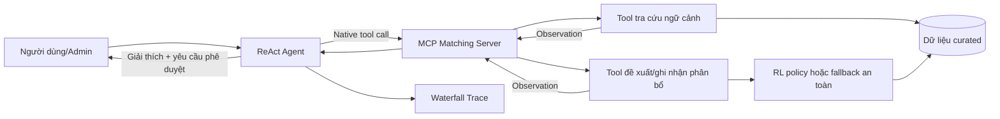

# Hướng dẫn sử dụng hệ thống RL ghép cặp sinh viên–giảng viên trong Lab 3

## 1. Mục đích tài liệu

Tài liệu này giải thích cách sử dụng ý tưởng và lõi tối ưu từ repository
[Matching_system_ReinforcementLearning](https://github.com/namhv521/Matching_system_ReinforcementLearning)
để xây dựng chủ đề mở cho Lab 3:

> **Trợ lý ghép cặp sinh viên thực hiện khóa luận với giảng viên hướng dẫn bằng
> Reinforcement Learning, được điều phối bởi ReAct Agent qua MCP Server.**

Đây là **thiết kế tích hợp đề xuất cho bài lab**, không phải tuyên bố rằng hai
repository đã được kết nối hoàn chỉnh. Tại thời điểm viết tài liệu:

- repository nguồn đã có pipeline dữ liệu, compatibility, môi trường matching,
  PPO có action masking, DQN và một số baseline;
- README của repository nguồn cho biết lớp ứng dụng phục vụ inference vẫn thuộc
  phần phát triển tiếp theo;
- mã Lab 3 đã khai báo schema và mock execution layer cho hai matching tool;
- MCP JSON-RPC, prompt, provider và ReAct loop đã hoàn thành; test suite đã được
  nghiệm thu bằng Gemini API thật. Kết nối inference RL production vẫn chưa làm.

Vì vậy, tài liệu mô tả **cách nên sử dụng** hệ thống RL trong kiến trúc Agent,
đồng thời chỉ rõ phần nào cần được triển khai ở các task tiếp theo.

## 2. Bài toán cần giải quyết

Với một cohort gồm `N` sinh viên và `M` giảng viên, hệ thống cần chọn một giảng
viên hướng dẫn cho từng sinh viên sao cho:

1. đề tài và hồ sơ sinh viên phù hợp với chuyên môn của giảng viên;
2. không giảng viên nào vượt quota;
3. workload giữa các giảng viên được cân bằng;
4. toàn bộ cohort được phân bổ hợp lệ, thay vì tối ưu riêng từng sinh viên;
5. kết quả có bằng chứng và có thể được quản trị viên/hội đồng kiểm tra.

Repository nguồn mô hình hóa mỗi episode như một lần phân bổ toàn cohort. Mỗi
bước xử lý một sinh viên; action là chọn một giảng viên. State gồm đặc trưng
sinh viên hiện tại, compatibility với các giảng viên, quota còn lại và workload
hiện tại. Khi một assignment được thực hiện, state thay đổi và ảnh hưởng đến
lựa chọn cho sinh viên tiếp theo.

## 3. Không dùng LLM để thay thế thuật toán RL

Kiến trúc đề xuất phân chia trách nhiệm như sau:

| Thành phần | Trách nhiệm | Không nên làm |
| :--- | :--- | :--- |
| **LLM/ReAct Agent** | Hiểu yêu cầu tự nhiên, chọn tool, yêu cầu thêm dữ liệu, giải thích kết quả và tạo trace. | Tự bịa compatibility, quota hoặc tự quyết định cặp ghép chỉ bằng kiến thức ngôn ngữ. |
| **MCP Server** | Công bố schema, kiểm tra tham số, định tuyến tool và chuẩn hóa Observation JSON-RPC. | Tự huấn luyện model hoặc thay đổi dữ liệu nguồn không qua kiểm soát. |
| **Matching service/RL policy** | Tạo đề xuất bằng compatibility, capacity, workload và policy đã qua evaluation gate. | Diễn giải tùy ý yêu cầu người dùng hoặc bỏ qua quota. |
| **Admin/Hội đồng** | Xem bằng chứng, chấp thuận hoặc từ chối phân bổ trước khi áp dụng. | Xem đề xuất tự động là quyết định cuối cùng không cần kiểm tra. |

Nguyên tắc cốt lõi là:

> **LLM điều phối và giải thích; RL tối ưu; MCP kiểm soát giao tiếp; con người
> phê duyệt quyết định có ảnh hưởng thực tế.**

## 4. Kiến trúc sử dụng đề xuất



### 4.1. Lớp dữ liệu

Theo repository nguồn, dữ liệu liên quan gồm:

- thông tin đề tài và role của sinh viên;
- hồ sơ chuyên môn, kỹ năng và bằng chứng của giảng viên;
- compatibility giữa đề tài và giảng viên;
- quota và workload hiện tại;
- báo cáo chất lượng và provenance của dữ liệu.

Không nên dùng trực tiếp dữ liệu raw để suy luận hoặc ghi đè dữ liệu nguồn.
Tool chỉ nên đọc dữ liệu đã được chuẩn hóa/curated. Dữ liệu cá nhân cần được giới
hạn quyền truy cập và không được đưa nguyên vẹn vào trace công khai.

### 4.2. Lõi quyết định RL

Thiết kế RL v1 trong repo nguồn sử dụng:

- **State:** sinh viên hiện tại, đặc trưng sinh viên, compatibility với `M`
  giảng viên, quota còn lại và workload hiện tại;
- **Action:** một số nguyên từ `0` đến `M-1`, tương ứng một giảng viên;
- **Transition:** tăng chỉ số sinh viên và workload của giảng viên được chọn;
- **Termination:** kết thúc khi đã xử lý hết cohort;
- **Action mask:** loại các giảng viên đã hết quota;
- **Reward:**

```text
reward = 1.0 × compatibility
       + 0.15 × fairness_bonus
       - 2.0 × invalid_penalty
```

PPO có action masking là policy chính. Tuy nhiên, không được mặc định rằng RL
luôn tốt hơn baseline. Policy chỉ nên được sử dụng khi vượt evaluation gate qua
nhiều seed, không vi phạm quota và không kém baseline có ý nghĩa thống kê.
Exact capacitated assignment có thể đóng vai trò upper bound hoặc fallback an
toàn cho admin.

## 5. Hai tool tối thiểu cho đề tài mở

Lab yêu cầu ít nhất một tool tra cứu và một tool hành động. Thiết kế này dùng:

1. `query_matching_context`: tra cứu dữ liệu phục vụ quyết định;
2. `assign_student_advisor`: tạo đề xuất hoặc ghi nhận phân bổ có kiểm soát.

Tên và schema dưới đây là **giao diện đề xuất cho Lab 3**, không phải API có sẵn
trong repository RL.

### 5.1. Tool tra cứu `query_matching_context`

#### Mục đích

Trả về hồ sơ tóm tắt của một sinh viên, các giảng viên phù hợp nhất, điểm
compatibility, quota còn lại và workload. Tool chỉ tra cứu, không thay đổi phân
bổ.

#### JSON Schema đề xuất

```json
{
  "name": "query_matching_context",
  "description": "Tra cứu ngữ cảnh ghép cặp khóa luận cho một sinh viên.",
  "parameters": {
    "type": "object",
    "properties": {
      "student_id": {
        "type": "string",
        "description": "Mã sinh viên cần tư vấn ghép cặp."
      },
      "top_k": {
        "type": "integer",
        "description": "Số ứng viên giảng viên cần trả về, từ 1 đến 10.",
        "minimum": 1,
        "maximum": 10,
        "default": 3
      }
    },
    "required": ["student_id"],
    "additionalProperties": false
  }
}
```

#### Observation mẫu

```json
{
  "status": "SUCCESS",
  "student": {
    "student_id": "SV001",
    "thesis_title": "Phát hiện gian lận giao dịch bằng học máy",
    "primary_role": "Machine Learning"
  },
  "candidates": [
    {
      "advisor_id": "GV012",
      "advisor_name": "Giảng viên A",
      "compatibility": 0.82,
      "remaining_quota": 2,
      "current_load": 3
    }
  ],
  "data_version": "curated-2026-09"
}
```

### 5.2. Tool hành động `assign_student_advisor`

#### Mục đích

Yêu cầu matching service đề xuất hoặc ghi nhận một cặp sinh viên–giảng viên.
Tool phải kiểm tra quota và policy trước khi trả thành công.

Để tránh ghi dữ liệu ngoài ý muốn, tool nên mặc định chạy ở chế độ
`dry_run: true`. Chỉ `commit` khi có phê duyệt của admin/hội đồng.

#### JSON Schema đề xuất

```json
{
  "name": "assign_student_advisor",
  "description": "Tạo đề xuất hoặc ghi nhận phân bổ sinh viên cho giảng viên.",
  "parameters": {
    "type": "object",
    "properties": {
      "student_id": {
        "type": "string",
        "description": "Mã sinh viên cần phân bổ."
      },
      "advisor_id": {
        "type": "string",
        "description": "Mã giảng viên được chọn."
      },
      "mode": {
        "type": "string",
        "enum": ["dry_run", "commit"],
        "description": "dry_run chỉ mô phỏng; commit yêu cầu quyền phê duyệt."
      },
      "approval_id": {
        "type": "string",
        "description": "Mã phê duyệt bắt buộc khi mode là commit."
      }
    },
    "required": ["student_id", "advisor_id", "mode"],
    "additionalProperties": false
  }
}
```

JSON Schema cơ bản không biểu diễn thuận tiện điều kiện “`approval_id` bắt buộc
khi `mode=commit`” trên mọi provider. Execution layer phải kiểm tra lại điều
kiện này trước khi ghi dữ liệu.

#### Observation mẫu ở chế độ mô phỏng

```json
{
  "status": "PROPOSED",
  "student_id": "SV001",
  "advisor_id": "GV012",
  "mode": "dry_run",
  "compatibility": 0.82,
  "quota_valid": true,
  "load_before": 3,
  "load_after": 4,
  "policy": "maskable_ppo",
  "model_version": "ppo-evaluated-v1",
  "requires_human_approval": true
}
```

#### Các trạng thái lỗi cần có

- `NOT_FOUND`: không tìm thấy sinh viên hoặc giảng viên;
- `INVALID_INPUT`: tham số sai schema;
- `QUOTA_EXCEEDED`: giảng viên đã hết quota;
- `POLICY_NOT_APPROVED`: model chưa vượt evaluation gate;
- `APPROVAL_REQUIRED`: yêu cầu commit chưa có phê duyệt;
- `EXECUTION_ERROR`: lỗi nội bộ, không được giả vờ phân bổ thành công.

## 6. Luồng ReAct cụ thể

Ví dụ yêu cầu:

> “Hãy tìm giảng viên phù hợp cho sinh viên SV001 và tạo đề xuất phân bổ, nhưng
> chưa ghi chính thức.”

Luồng mong muốn:

1. **Thought:** cần biết đề tài, compatibility, quota và workload.
2. **Action:** gọi `query_matching_context(student_id="SV001", top_k=3)`.
3. **Observation:** nhận danh sách ứng viên và dữ liệu quota.
4. **Thought:** chọn ứng viên hợp lệ theo policy/kết quả service, không chọn chỉ
   dựa trên suy đoán của LLM.
5. **Action:** gọi `assign_student_advisor(student_id="SV001",
   advisor_id="GV012", mode="dry_run")`.
6. **Observation:** nhận trạng thái `PROPOSED`, compatibility, quota và model
   version.
7. **Final Answer:** giải thích lý do đề xuất, nêu rõ chưa ghi chính thức và yêu
   cầu người có thẩm quyền phê duyệt.

Waterfall trace rút gọn:

```json
[
  {
    "step": 1,
    "action_type": "TOOL_EXECUTION",
    "tool_name": "query_matching_context",
    "arguments": {"student_id": "SV001", "top_k": 3},
    "observation": {"status": "SUCCESS", "candidate_count": 3}
  },
  {
    "step": 2,
    "action_type": "TOOL_EXECUTION",
    "tool_name": "assign_student_advisor",
    "arguments": {
      "student_id": "SV001",
      "advisor_id": "GV012",
      "mode": "dry_run"
    },
    "observation": {
      "status": "PROPOSED",
      "quota_valid": true,
      "requires_human_approval": true
    }
  },
  {
    "step": 3,
    "action_type": "FINAL_ANSWER",
    "output": "Đã tạo đề xuất ở chế độ mô phỏng; chưa ghi phân bổ chính thức."
  }
]
```

## 7. Hai chế độ sử dụng nên tách biệt

### 7.1. Tư vấn một sinh viên

Phù hợp cho giao diện hội thoại. Agent tra cứu top-k ứng viên, gọi matching
service ở chế độ `dry_run`, rồi giải thích kết quả. Cần cảnh báo rằng lựa chọn
cục bộ có thể không tối ưu toàn cohort.

### 7.2. Phân bổ toàn cohort

Đây mới là bài toán mà môi trường RL của repo nguồn mô tả. Một service chuyên
biệt nên chạy policy trên toàn cohort và trả về:

- danh sách assignment;
- mean compatibility;
- load variance;
- quota violations;
- model/config/data version;
- so sánh với baseline hoặc fallback.

Agent chỉ khởi tạo job, theo dõi trạng thái và giải thích báo cáo. Không nên gọi
tool một lần cho từng sinh viên theo thứ tự tùy ý rồi coi đó là kết quả tối ưu
toàn cohort, vì cách này có thể làm mất lợi ích của long-horizon policy.

## 8. Guardrails bắt buộc

1. **Quota là hard constraint:** không cho phép LLM ghi đè action mask.
2. **Human-in-the-loop:** mặc định `dry_run`; `commit` cần `approval_id` và
   kiểm tra quyền ở backend.
3. **Evaluation gate:** không dùng PPO trong thực tế chỉ vì model đã train;
   phải kiểm tra nhiều seed, hold-out và baseline.
4. **Fallback an toàn:** khi model không đạt gate hoặc lỗi, dùng exact
   capacitated assignment/baseline đã phê duyệt hoặc chuyển cho admin.
5. **Không hallucination:** câu trả lời chỉ được dùng compatibility, quota và
   trạng thái có trong Observation.
6. **Bảo vệ dữ liệu:** không commit `.env`, checkpoint, log hoặc dữ liệu cá nhân;
   trace chỉ lưu trường cần thiết và nên ẩn danh khi công khai.
7. **Tái lập:** ghi `model_version`, `data_version`, seed/config và backend tính
   compatibility trong mỗi batch phân bổ.
8. **Không dùng lịch sử làm chân lý tuyệt đối:** historical top-1 chỉ đo mức tái
   tạo assignment cũ, không chứng minh assignment đó tối ưu.

## 9. Vì sao Agentic Fit là 14/20, không phải 20/20

| Tiêu chí | Điểm | Diễn giải thận trọng |
| :--- | :---: | :--- |
| Multi-step Reasoning | 4/5 | Có chuỗi tra cứu–kiểm tra–đề xuất, nhưng nhiều bước là pipeline có cấu trúc. |
| Tool Interaction | 3/5 | Kiến trúc cần hai tool, nhưng repo nguồn chưa có lớp MCP/inference hoàn chỉnh. |
| Dynamic Decision | 4/5 | Capacity và workload thay đổi sau mỗi action, nhưng policy RL xử lý phần lớn logic động. |
| Long Horizon Goal | 3/5 | Mục tiêu kéo dài trong một cohort; chưa có memory/feedback đáng tin cậy qua nhiều cohort. |
| **Tổng** | **14/20** | Agent phù hợp để điều phối và giải thích, không thay thế lõi tối ưu RL. |

## 10. Ánh xạ thiết kế vào mã Lab 3

Đây là danh sách thay đổi cần làm ở các task sau; tài liệu này **không đánh dấu
chúng là đã hoàn thành**.

| File Lab 3 | Thay đổi dự kiến |
| :--- | :--- |
| `src/tools.py` | **Đã hoàn thành:** schema và mock execution layer của `query_matching_context`, `assign_student_advisor`. |
| `src/mcp_server.py` | **Đã hoàn thành:** dispatch và trả Observation JSON-RPC 2.0. |
| `src/prompts.py` | **Đã hoàn thành:** prompt matching với quota, dry-run, approval và anti-hallucination. |
| `src/providers.py` | **Đã nghiệm thu Gemini:** Native Tool Calling thật, schema adapter, rate limit và chế độ cấm fallback khi nghiệm thu. |
| `src/app.py` | **Đã hoàn thành:** đưa Observation vào lượt tiếp theo và hỗ trợ nhiều tool call trước Final Answer. |
| `config/test_cases.json` | Viết năm test gồm direct query, lookup, dry-run assignment, multi-step và edge case quota/not-found. |
| `docs/trace_waterfall.json` | **Đã sinh bằng Gemini API thật:** 5/5 test, 4 tool calls, không fallback. |
| `docs/trace_eval.md` | Dán trace thật, số test thành công và số tool call chính xác. |

Một adapter thực tế giữa Lab 3 và repo RL có thể là module/service riêng. Adapter
đọc artifact đã version hóa hoặc gọi inference service; không nên import trực
tiếp script training vào request của MCP vì training chậm, khó kiểm soát và
không phù hợp đường xử lý tương tác.

## 11. Test case tối thiểu cho thiết kế

1. **Direct query:** hỏi hệ thống dùng tiêu chí nào; Agent trả lời mà không gọi
   tool nếu thông tin nằm trong system prompt.
2. **Lookup:** tra cứu top-3 giảng viên cho một sinh viên hợp lệ; chỉ gọi
   `query_matching_context`.
3. **Dry-run assignment:** tạo đề xuất nhưng không ghi chính thức; phải trả
   `requires_human_approval=true`.
4. **Multi-step:** tra cứu rồi tạo đề xuất; trace phải có hai lần gọi tool.
5. **Edge case:** giảng viên hết quota, sinh viên không tồn tại hoặc model chưa
   đạt evaluation gate; Agent phải giải thích lỗi và không bịa assignment.

## 12. Tiêu chí nghiệm thu tích hợp

- [ ] Hai tool có JSON Schema hợp lệ và không nhận thuộc tính ngoài schema.
- [ ] MCP Server trả JSON-RPC 2.0 với Observation không rỗng.
- [ ] Tool tra cứu không thay đổi trạng thái phân bổ.
- [ ] Tool hành động mặc định `dry_run` và chặn `commit` thiếu phê duyệt.
- [ ] Quota không bị vượt trong mọi test.
- [ ] Trace multi-step có Thought → Action → Observation → Action →
      Observation → Final Answer.
- [ ] Final Answer nêu compatibility, quota/workload và trạng thái dry-run dựa
      trên Observation thực tế.
- [ ] Lần nghiệm thu dùng LLM API thật, không dùng `MockOfflineProvider`.
- [ ] Báo cáo ghi model/data version và không chứa dữ liệu nhạy cảm.

## 13. Nguồn tham khảo

- [README — Matching_system_ReinforcementLearning](https://github.com/namhv521/Matching_system_ReinforcementLearning/blob/main/README.md)
- [Thiết kế thuật toán RL v1](https://github.com/namhv521/Matching_system_ReinforcementLearning/blob/main/docs/rl_algorithm_design.md)
- [Agent guide của repository nguồn](https://github.com/namhv521/Matching_system_ReinforcementLearning/blob/main/agent.md)
- [`CODELAB.md`](CODELAB.md)
- [`trace_eval.md`](trace_eval.md)

> **Kết luận:** Cách sử dụng phù hợp nhất là đặt RL policy phía sau MCP tool như
> một dịch vụ quyết định có kiểm soát. ReAct Agent không thay RL; Agent biến yêu
> cầu ngôn ngữ tự nhiên thành chuỗi tra cứu–đề xuất–giải thích có trace và có
> bước phê duyệt của con người.